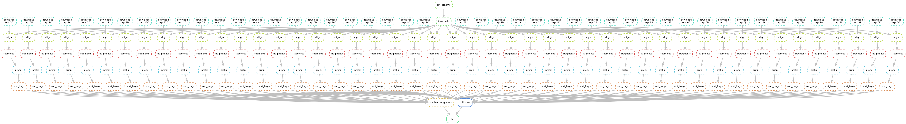

# Brain initiative cell census network 

Code to process raw scATAC-seq data for the adult mouse brain generated by the
BICCN consortium.

Steps:

1. Download fastq files from [NEMO](https://nemoarchive.org/) for each brain region
2. Download mm10 genome fasta from UCSC and create bwa index
3. Map fastq files to mm10 using [bwa mem](https://github.com/lh3/bwa), pipe output to samtools to create bam file
4. Sort and index bam file with [samtools](https://www.htslib.org/)
5. Create fragment file from bam file using [sinto](https://github.com/timoast/sinto)
6. Sort, bgzip-compress, and index fragment file using bgzip and [tabix](https://www.htslib.org/doc/tabix.html)
7. Call peaks for each region using [MACS2](https://github.com/macs3-project/MACS)

The pipeline is constructed using [snakemake](https://snakemake.readthedocs.io/en/stable/index.html).
To run the pipeline, first install miniconda, then create a conda environment for the pipeline using
the environment.yaml file. This will install all the dependencies needed:

```
conda env create -f environment.yaml
```

Or using [mamba](https://github.com/QuantStack/mamba):

```
mamba env create -f environment.yaml
```

This creates an environment called `biccn`. Activate this environment when running the
pipeline: `conda activate biccn`.

You can execute a dry-run of the pipeline to see what steps will be run using:
`snakemake -n`

To run the pipeline and generate the outputs, run:

```
snakemake --cores 10
```

Map of the pipeline:


